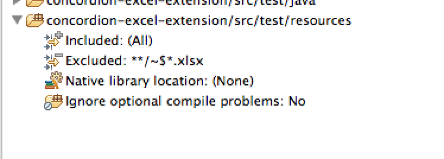

[Concordion](http://www.concordion.org) is an open source framework for Java that lets you turn a plain English description of a requirement into an automated test.
 
This project enables concordion to parse an Excel spreadsheet and use it as input data.   

Vanilla Concordion is designed to process test specifications written in using a combination of an HTML Document
and a Java fixture class.  When Concordion runs the test, it takes the HTML document and uses it as as the basis 
of a test report, colouring the report as it goes to show which parts of the test have passed and failed.

The Concordion Excel Extension changes this so that the HTML Document is replaced by an Excel spreadsheet.  
The spreadsheet is parsed into an HTML structure first, and then from there on processed through Concordion 
in the normal way.  

Motivation
----------

So, the extension simply gives you a different format for your test specification.  Why would it be sometimes
preferable to represent this as an Excel document rather than an HTML one?  Three reasons:

1.  Perhaps the team of test writers are not familiar with writing HTML, or are more comfortable with Excel.
2.  You're constructing lots of tables containing the test examples.  Excel's table support is very polished and easy to use compared 
to most HTML editors, or HTML-by-hand.
3.  You're testing calculations which can be easily expressed in Excel functions.  It makes sense for the testers to write
examples using the functions rather than calculating them by hand and putting the results into the test specification.  In fact, if you're
here, your testers are probably calculating the test examples using Excel anyway.

Caveats
=======

Version Control
---------------

Excel's xlsx format is a zip file containing lots of futher XML files, plus any images that might be needed in the document.  While this is
an open format now, most version control systems aren't able to do a line-by-line diff on the zip, so effectively you will be checking in 
the spreadsheet as though it is a binary format.

Note on Windows / Eclipse Usage
-------------------------------

Eclipse gets confused about Windows Temporary Files if they are in the build path  (e.g. src/test/resources).  This means
that if you have Excel open, Eclipse stops building your project.   But, there is a simple workaround for this, which is 
to add an exclusion pattern like so:

If you are generating the Eclipse .classpath file using Maven, you can add this to your maven pom.xml file to do the same thing:

	<project>
	  ...
	  <build>
	    ...
	    <resources>
	      <resource>
	        <directory>src/main/resources</directory>
	        <filtering>true</filtering>
	        <includes>
	          <exclude>**/~$*.xlsx</include>
	        </includes>
	      </resource>
	      ...
	    </resources>
	    ...
	  </build>
	  ...
	</project>

Additionally, if you are editing files in Excel, it is good practice to turn on the Workspace refresh options so 
that Eclipse can keep track of the changes you make and keep your bin/ directory up-to-date.	

Documentation
=============

1. [beginners tutorial](tutorial.md)
2. [Specification](http://concordion.github.io/concordion-excel-extension/spec/ExcelConcordionTutorial.html)

